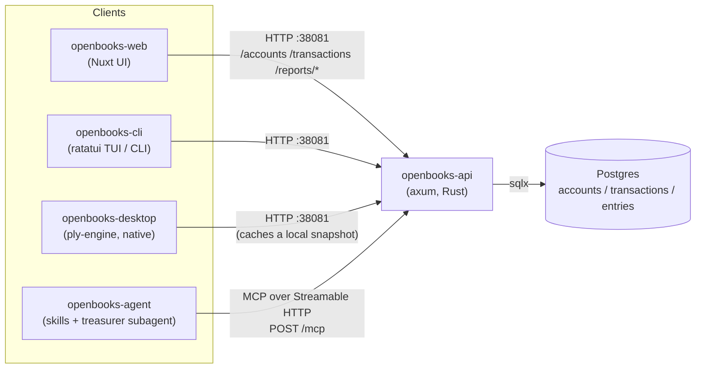

OpenBooks is one Postgres database, one Rust API that speaks both plain HTTP
and MCP, and four different front ends that all talk to that same API.

## The pieces

- **Postgres** holds the ledger — `accounts`, `transactions`, `entries` — and
  the trigger that guarantees it stays balanced (see
  [Invariants](/openbooks-docs/concepts/invariants/)). It runs in Docker, brought up by
  `docker compose` (directly, or via `just run` / `just desktop`).
- **`openbooks-api`** is a single Rust binary (axum + sqlx) that exposes two
  interfaces over the same port, `:38081`:
  - Plain HTTP routes — `/accounts`, `/transactions`,
    `/reports/balances`, `/reports/income-statement`,
    `/reports/balance-sheet` — defined in `openbooks-api/src/lib.rs`.
  - An **MCP server** mounted at `/mcp` (Streamable HTTP, `openbooks-api/src/mcp.rs`),
    so an AI assistant can read the books and record transactions the same
    way the web UI does.
- **`openbooks-web`** — a Nuxt UI. Dashboard, history, reports, and
  categories, all composing transactions from a plain-English amount/account/
  category rather than exposing debits and credits.
- **`openbooks-cli`** — a Rust terminal client. Run it with no arguments for
  a `ratatui` TUI (four tabs: Dashboard, History, Reports, Record); give it a
  subcommand (`balances --json`, `income --from ... --to ... --json`) and it
  becomes a quiet, scriptable CLI instead.
- **`openbooks-desktop`** — a native Rust app built on
  [ply-engine](https://github.com/TheRedDeveloper/ply-engine), which renders
  the same code across desktop, mobile, and web targets (only the desktop
  build has actually been exercised so far). It caches the last successful
  sync to a local JSON snapshot and goes strictly read-only — no record form,
  no delete buttons — when the API can't be reached, rather than queuing
  writes for later.
- **`openbooks-agent`** — a cross-harness agent plugin (skills, a
  `treasurer` subagent, and slash commands) that drives the API's MCP
  endpoint, so a coding agent or chat assistant can act as the treasurer
  without ever constructing a debit or a credit itself.

## What talks to what



Every client except the agent plugin talks to the same set of plain HTTP
routes. The agent plugin is the only one that goes through `/mcp` — it's
built for an AI assistant to drive directly, so JSON-RPC tool calls fit
better than hand-building HTTP requests. Nothing stops a human-facing client
from using `/mcp` too; it's just that today only the agent plugin does.

## One set of query functions

The HTTP handlers and the MCP tools in `openbooks-api` are two thin layers
over the *same* underlying functions — `accounts_data`, `transactions_data`,
`create_transaction_data`, `account_balances_data`, `income_statement_data`,
and `balance_sheet_data`, all in `openbooks-api/src/lib.rs`. An HTTP route
handler calls one of these and wraps the result in `Json(...)`; an MCP tool
call in `openbooks-api/src/mcp.rs` calls the exact same function and wraps
the result as MCP tool content. Neither layer talks to the database
directly or re-implements a query.

That's deliberate, and stated as an invariant in the root `CLAUDE.md`: add or
change a report and both interfaces get it for free, because there's only
one place the query logic lives. Reimplementing a report's SQL inside
`mcp.rs` instead of calling the shared function would let the two interfaces
drift apart and start disagreeing about the same numbers.

## Everything is a git submodule

`openbooks-api`, `openbooks-web`, `openbooks-desktop`, `openbooks-cli`, and
`openbooks-agent` are each their own git repository, checked into the
`openbooks` superproject as submodules. Each has its own README, its own
history, and (for the Rust projects) its own `just` targets for running and
testing in isolation.

The superproject's `justfile` is what actually drives local development —
`just run`, `just desktop`, `just cli`, `just seed`, `just reset`, and so on
— rather than any submodule being run standalone day to day. Cloning with
`--recurse-submodules` pulls in all five at once:

```sh
git clone --recurse-submodules https://github.com/hatchertechnology/openbooks
```

Per the root `CLAUDE.md`, changes land in the relevant submodule first, then
the superproject's pointer to that submodule gets bumped in a follow-up
commit — never the other way around.
